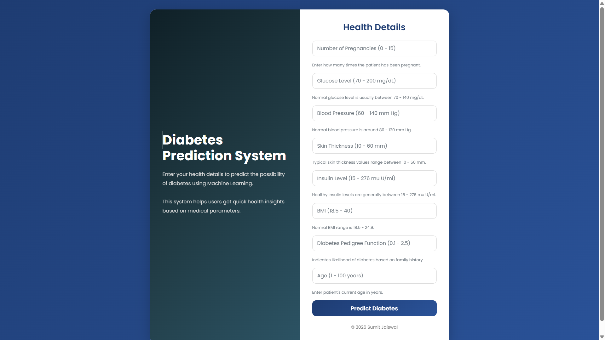

# 🩺 Diabetes Prediction Web App

A Machine Learning-based web application that predicts the likelihood of diabetes using user health parameters.  
The project is built using **Python, Flask, Scikit-learn, HTML, CSS, and Bootstrap** with a modern responsive UI.

---

## 🚀 Features

- 🔍 Predicts diabetes risk using Machine Learning
- 💻 Modern responsive user interface
- ⚡ Fast real-time prediction system
- 🧠 Trained ML classification model
- 📝 Input validation for better user experience
- 🌐 Flask backend integration
- 📱 Mobile-friendly design
- 🚀 Easily deployable on Render/Railway/Heroku

---

# 🛠️ Tech Stack

## Frontend
- HTML5
- CSS3
- Bootstrap

## Backend
- Python
- Flask

## Machine Learning
- Scikit-learn
- Pandas
- NumPy

---

# 📊 Input Parameters

The model predicts diabetes based on the following health parameters:

- Pregnancies
- Glucose Level
- Blood Pressure
- Skin Thickness
- Insulin
- BMI
- Diabetes Pedigree Function
- Age

---

# 📂 Project Structure

```bash
Diabetes-Prediction/
│
│
├── templates/
│   └── index.html
│
├── model.pkl
├── app.py
├── diabetes.csv
├── requirements.txt
├── Procfile
└── README.md
```

---

# ⚙️ Installation & Setup

## 1️⃣ Clone Repository

```bash
git clone https://github.com/your-username/Diabetes-Prediction.git
```

## 2️⃣ Move to Project Folder

```bash
cd Diabetes-Prediction
```

## 3️⃣ Create Virtual Environment

```bash
python -m venv venv
```

## 4️⃣ Activate Virtual Environment

### Windows

```bash
venv\Scripts\activate
```

### Mac/Linux

```bash
source venv/bin/activate
```

## 5️⃣ Install Dependencies

```bash
pip install -r requirements.txt
```

## 6️⃣ Run Application

```bash
python app.py
```

---

# 🌐 Open in Browser

```bash
http://127.0.0.1:5000
```

---

# 🤖 Machine Learning Workflow

- Data Collection
- Data Cleaning
- Feature Selection
- Train-Test Split
- Model Training
- Model Evaluation
- Prediction Generation
- Flask Integration
- Deployment

---

# 📈 Future Improvements

- Add prediction probability score
- Add charts and health analytics
- Store prediction history using database
- Add user authentication
- Improve model accuracy
- Add dark mode UI
- Deploy with CI/CD pipeline

---

## 📸 Project Preview

<p align="center">
  
</p>

---

# 👨‍💻 Author

## Sumit Jaiswal

---

# ⭐ Support

If you like this project, give it a ⭐ on GitHub!

---
